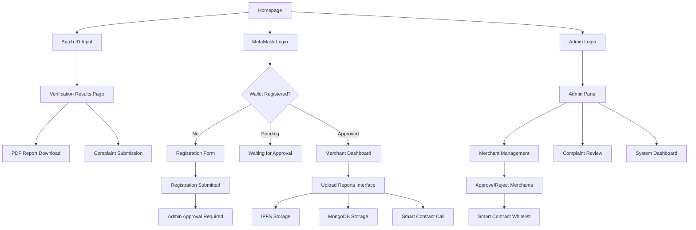

# Blockchain-Based Protein Powder Verification System - Product Requirements Document

## 1. Product Overview

A blockchain-based DApp that solves the problem of fake and mislabelled protein powders in the supplement industry, particularly in Malaysia. The system enables users to verify protein powder authenticity through immutable blockchain records, IPFS file storage, and comprehensive lab test data.

The platform ensures all product data is trusted and traceable by leveraging smart contracts for data integrity, IPFS for decentralized file storage, and MongoDB for structured data retrieval.

## 2. Core Features

### 2.1 User Roles

| Role | Registration Method | Core Permissions |
|------|---------------------|------------------|
| General User | No registration required | Can verify products via Batch ID, view reports, download PDF reports, submit complaints |
| Certified Merchant | MetaMask wallet authentication + admin whitelist approval | Can upload 3 types of reports (ingredient info, process tests, lab authentication), call smart contract functions |
| Admin | Secure admin panel login | Can whitelist/blacklist merchants, manage complaints, view all system records and logs |

### 2.2 Feature Module

Our blockchain verification system consists of the following main pages:

1. **Homepage**: Three distinct entry points - Batch ID verification for general users, MetaMask merchant login with registration flow, admin login with username/password
2. **Merchant Registration Page**: Registration form for new merchants, pending approval status display, wallet address verification
3. **Merchant Dashboard**: MetaMask wallet connection, report upload interface (3 types), batch ID generation, upload history
4. **Admin Panel**: Merchant management interface with approval workflow, complaint review system, system analytics dashboard, whitelist/blacklist controls
5. **Verification Results Page**: Detailed product information display, lab test results, authentication data, PDF report download

### 2.3 Page Details

| Page Name | Module Name | Feature description |
|-----------|-------------|---------------------|
| Homepage | Batch ID Verification | Input batch ID, retrieve data from smart contract and MongoDB, display ingredient info and lab results |
| Homepage | Merchant MetaMask Login | Connect MetaMask wallet, check registration status, redirect to appropriate flow (registration/pending/dashboard) |
| Homepage | Admin Login | Username/password authentication, redirect to admin panel upon successful login |
| Homepage | Complaint System | Submit merchant complaints with evidence images, store using Multer with file paths in MongoDB |
| Merchant Registration | Registration Form | Collect merchant details (name, organization, email, wallet address), submit for admin approval |
| Merchant Registration | Status Display | Show registration status (pending approval, approved, rejected), display appropriate messages |
| Merchant Dashboard | MetaMask Authentication | Connect wallet, verify whitelist status, authenticate merchant identity |
| Merchant Dashboard | Report Upload Interface | Upload 3 report types (ingredients, process tests, lab authentication) to IPFS with SHA-256 hash generation and MongoDB |
| Merchant Dashboard | Smart Contract Integration | Call uploadReport function with IPFS hashes, generate dynamic batch IDs (PROT-YYYYMMDD-X format) |
| Merchant Dashboard | Upload History | View previously uploaded reports, track submission status, manage batch records |
| Admin Panel | Merchant Management | Add/remove wallet addresses from whitelist, approve merchant applications, blacklist merchants |
| Admin Panel | Complaint Review | Review user complaints from local storage, manage evidence files, take action on reported merchants |
| Admin Panel | System Dashboard | View all uploaded records, monitor merchant activity, access system logs and analytics |
| Verification Results | Product Information Display | Show ingredient details, purity levels, BCAA content, fat content, moisture levels |
| Verification Results | Lab Test Results | Display process test details, electrophoresis patterns, lactose detection results |
| Verification Results | Authentication Data | Show lab credentials, certification IDs, merchant wallet addresses, document hashes with SHA-256 verification |

## 3. Core Process

**General User Flow:**
Users enter a batch ID on the homepage to verify product authenticity. The system retrieves IPFS hashes from the smart contract and structured data from MongoDB to display comprehensive product information. Users can download a PDF report and optionally submit complaints about merchants using local file storage.

**Merchant Registration and Login Flow:**
New merchants click "Login with MetaMask" on the homepage and connect their wallet. If not registered, they complete a registration form with name, organization, email, and wallet address (auto-filled). The system saves their information to MongoDB with pending status and displays "Registration submitted. Please wait for admin approval." Once approved by admin, subsequent MetaMask logins redirect directly to the merchant dashboard.

**Certified Merchant Flow:**
Approved merchants connect their MetaMask wallet and access the dashboard. They upload three types of reports (ingredient information, process test details, lab authentication info) which are stored in both IPFS and MongoDB with SHA-256 hash generation for file integrity. The system calls the smart contract's uploadReport function with the IPFS hashes and generates dynamic batch IDs.

**Admin Flow:**
Admins login with username/password credentials to access the admin panel. They review pending merchant registrations and approve/reject applications, which adds wallet addresses to the smart contract whitelist. They also review user complaints from local file storage, monitor all system records, and can blacklist merchants for misconduct.

## 4. User Interface Design

### 4.1 Design Style

- **Primary Colors**: Deep blue (#1e3a8a) for trust and security, green (#10b981) for verification success
- **Secondary Colors**: Gray (#6b7280) for neutral elements, red (#ef4444) for warnings/complaints
- **Button Style**: Rounded corners with subtle shadows, gradient backgrounds for primary actions
- **Font**: Inter or Roboto for readability, 16px base size, 14px for secondary text
- **Layout Style**: Card-based design with clean spacing, top navigation with wallet connection status
- **Icons**: Blockchain and security-themed icons, shield icons for verification, upload icons for file management

### 4.2 Page Design Overview

| Page Name | Module Name | UI Elements |
|-----------|-------------|-------------|
| Homepage | Batch ID Verification | Large search input with blockchain-style border, verification status cards with green/red indicators, clean typography for product details |
| Homepage | Complaint System | Modal form with file upload dropzone, evidence image preview, submission confirmation with local file storage |
| Merchant Dashboard | MetaMask Connection | Prominent wallet connection button, wallet address display, whitelist status indicator with color coding |
| Merchant Dashboard | Upload Interface | Three-column layout for report types, drag-and-drop file upload areas, progress indicators for IPFS uploads |
| Admin Panel | Management Interface | Data tables with sorting/filtering, action buttons for whitelist operations, status badges for merchant verification |
| Verification Results | Product Display | Information cards with icons, lab test result tables, authentication badges, prominent PDF download button |

### 4.3 Responsiveness

The application is desktop-first with mobile-adaptive design. Touch interaction optimization is implemented for mobile users accessing verification features. The merchant dashboard prioritizes desktop experience for file uploads, while the homepage verification is fully optimized for mobile users checking products on-the-go.